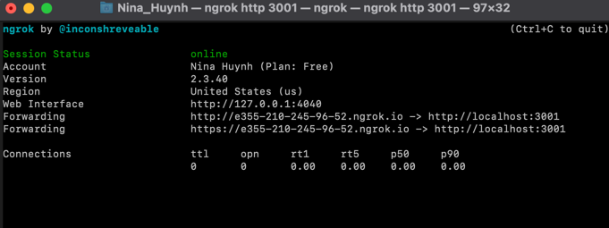

# Auth0 notice

Since localhost can not request access token silently, we need to proxy our way to auht0.

Run `npm install-g ngrok`
Then `ngrok config add-authtoken ${TOKEN}`

Get your token from `https://dashboard.ngrok.com/get-started/your-authtoken`

Then run `ngrok http 3000` to start the proxy process.
Now when going to https://e355-210-245-96-52.ngrok.io, I was able to route my way back to our frontend app.

Now the final step would be adding your address
to [auth0 dashboard](https://manage.auth0.com/dashboard/us/dev-elws5e13/applications/sydQIoZtakHrJ9b4dvfzWyCs2ZGWwFzs/settings)
and you can login now.

# 1Car Frontend resources

Frontend library: [AntDesign](https://ant.design).

Design system: [AntDesign design system](https://ant.design/docs/resources).

CSS Framework: [Tailwind CSS](https://tailwindcss.com/docs/installation).

# Testing

This repo uses Jest for unit testing and Cypress for e2e testing.

To run tests and produce coverage report, run `npm run test:cov`.

If there's a problem generating the coverage report, try emptying the coverage folder.
