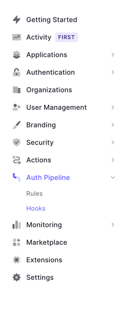
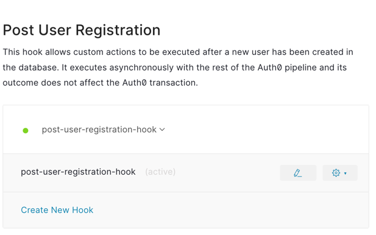
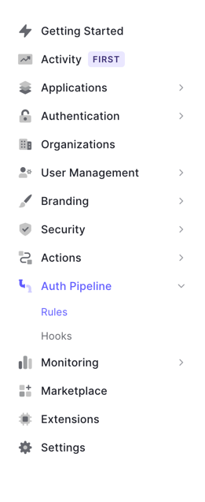
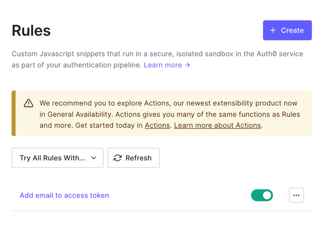

# Auth0 

<h2>What is auth0?</h2>

[Auth0](https://auth0.com/) is a flexible, drop-in solution to add authentication and authorization services to your applications. Your team and organization can avoid the cost, time, and risk that come with building your own solution to authenticate and authorize users.

<h3>What is use inside our project?</h3>

We use Auth0 as a way to authenticate user. The whole flow with how auth0 interact with our app is included in this [UML](https://miro.com/app/board/uXjVPaY61y8=/?share_link_id=337590047938).

User get to sign up and sign in using the Auth0 universal login page. Source of truth for authentication is kept by auth0 also.\
After sign in or sign up successfully, the user will be redirected to our homepage with a client token and by using that client token, we are able to get access token generated by Auth0.

We will use this access token to communicate with the backend. In this token, there will be email of the user, which is used to find for the user authorization in our database.

More information on auth0 login flow can be found [here](https://auth0.com/docs/customize/actions/flows-and-triggers/login-flow).


<h3>What need to be config with Auth0?</h3>

<h4>Auth0 dashboard</h4>

First sign up for auth0 account [here](https://auth0.com/signup?place=header&type=button&text=sign%20up).

After signing up, a new application has been created for you. You can choose to create a new one or use the existed application.
You can see the [dashboard](https://manage.auth0.com/?_ga=2.158412147.87667419.1662948924-597817230.1660732035&_gl=1*jid53q*rollup_ga*NTk3ODE3MjMwLjE2NjA3MzIwMzU.*rollup_ga_F1G3E656YZ*MTY2Mjk3MjgzMS4zNy4xLjE2NjI5NzQ0ODUuNi4wLjA.#/applications) 

Then go to your app dashboard and set the callback url, logout url and allowed web origin to be your frontend app.

Since the user is signing up using the Auth0 universal login page, we would need to config the post registration hook
to send back to our backend app user information such as there email and name.

<h5>Post registration hook</h5>

You can find the hooks setting page in auth pipeline > hooks from your side menu in dashboard of your own app.


Then scroll down to find post user registration hook and create your own hook.


The following script can be helpful if you want to create your own hook.
Note that since we do development only, we use [ultrahook](https://www.ultrahook.com/) to receive hook and proxy back to our backend app to process.

```js
module.exports = function (user, context, cb) {
  const userInfo = {
    name: user.email.split('@')[0],
    email: user.email
  };

  const axios = require('axios');
  // Add your hook link into array
  const urlArray = [ ];

  const postUserInfo = async (url) => {
      try {
        const res = await axios.post(url + "/user", userInfo, {
        headers: {
          'Content-Type': 'application/json',
          'Authorization': '1car_secret_token_string'
        }
      });
      console.log(res);
      } catch(error) {
        console.log(error)
      }
    };
  for (let url of urlArray) {
    postUserInfo(url);
  }
  cb();
};

```

To use ultrahook, sign up for your API key [here](https://www.ultrahook.com/register). And follow the tutorial.

<h5>Add email to access token</h5>

Since we also want the token to include user email, we also set the rule to add email to access token.
Go to rules in Auth Pipeline submenu.


You can create a new one or edit the existed template provided by auth0 


The following script can be helpful if you want to create you own hook:

```js

function addEmailToAccessToken(user, context, callback) {
  // This rule adds the authenticated user's email address to the access token.

  context.accessToken['email'] = user.email;
  return callback(null, user, context);
}

```

<h4>Frontend</h4>
Our app use the template create-react-app. Therefore, we are also using the SDK React of Auth0.

Install Auth0 React SDK by running ```npm install @auth0/auth0-react```

Then wrap Auth0 provider outside your app like in our [index.tsx](../../src/index.tsx).\
Note that we have taken REACT_APP_AUTH0_DOMAIN, REACT_APP_AUTH0_CLIENT_ID from the dashboard setting of auth0 and put it in our .env file.

Now you can add login to the application using redirect like [Login Button](../../src/components/auth/AuthButtons.tsx).

And use the user information from anywhere using the ```useAuth0()``` hook.

Many more tutorial can be found [here](https://auth0.com/docs/quickstart/spa/react/01-login)

<h4>Backend</h4>

For backend, we only need to check the token send with the request to see if it is valid or not.

Therefore, we implement a [guard](https://github.com/tech-university-vietnam/1Car-BE/blob/main/src/api/auth/guards/jwt-auth-guard.ts) using a specific [strategy](https://github.com/tech-university-vietnam/1Car-BE/blob/main/src/api/auth/strategy/jwt.strategy.ts) follow auth0 strategy.

Then apply that as a global guard for all endpoint except for one that is marked as ```@Public()```.

For more tutorial and information, you can check at [passportjs auth0 website](https://www.passportjs.org/packages/passport-auth0/).
