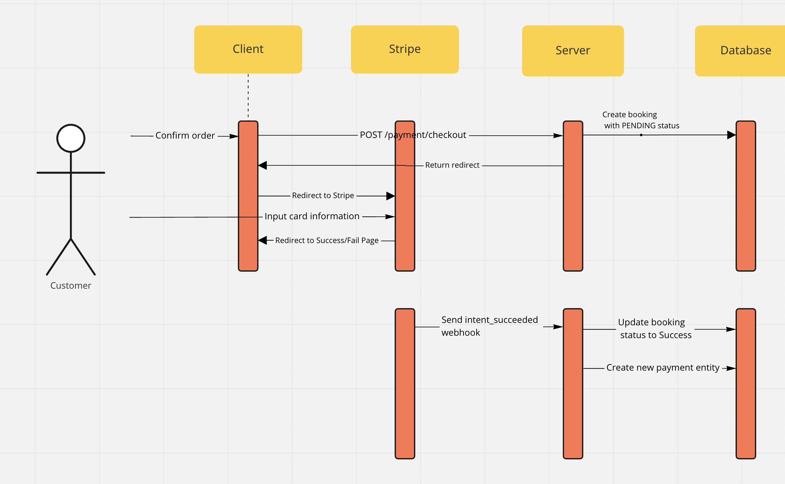
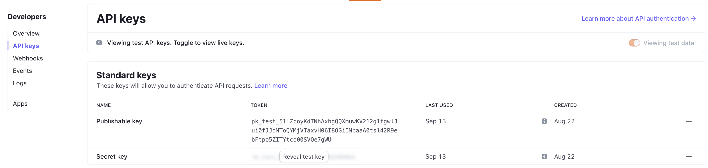
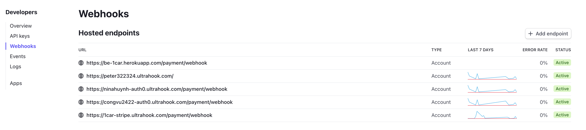
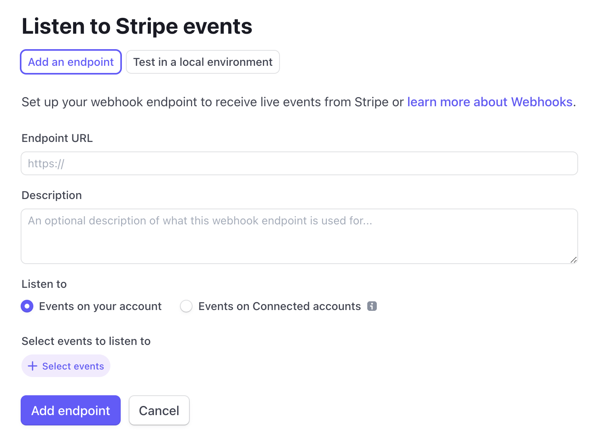

# Stripe

Stripe is used as a third-party library to ensure security to our online payment and booking process.

## How is it integrated?

For this application, we utilizes the Stripe Checkout Portal to receive online payments from the customers. The general flow of the payment process is as above
## Register and Get Secret Key

In order to setup Stripe for the application, please register an account [here](https://stripe.com/). Next, navigate to the Developers Dashboard and get the Secret key from the API Keys tab. Paste the secret key as a value to the STRIPE_SECRET_KEY in .env file.

## Setup Stripe Webhooks

For Stripe to be able to send webhook whenever payment is successful (or failed), we need to configure it on Stripe Dashboard.

First navigate to your Developers Dashboard, click on tab Webhooks on the left. Then click on Add endpoint.

Input your endpoint URL, which is the URL of the ultrahook endpoint in the previous session + /payment/webhook (e.g: https://1car-stripe.ultrahook.com/payment/webhook)

Select events to listen to. In our case we're only concerned when payment is succcess, failed or when checkout session is expired, so let's tick on these three boxes: payment_intent.canceled, payment_intent.payment_failed, payment_intent.succeeded.

## Use Ultrahook to listen events from local

In order for your local server to be able to listen to webhook events from Stripe, we need to use Ultrahook. Please follow the ultrahook setup instructions [here](https://www.ultrahook.com/). After setting up, please input `ultrahook stripe 8080` on your terminal